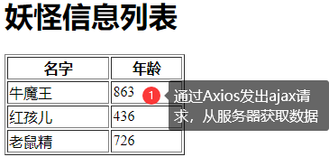
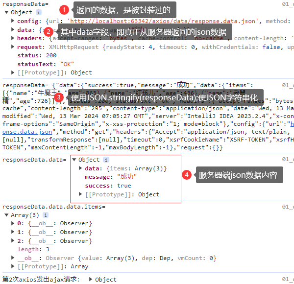
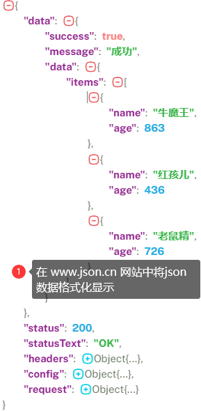

# Axios

## 基本说明

1. `axios`是独立于vue的一个项目，不是vue的一部分
2. `axios`通常和vue一起使用，实现ajax操作
3. `Axios`是一个基于 `promise` 的HTTP库
4. [Axios学习文档](https://www.javasoho.com/axios/)
5. 使用Axios需要引入axios库文件

```javascript
// 方式一：直接引入
<script src="https://unpkg.com/axios/dist/axios.min.js"></script>

// 方式二：下载 axios.min.js 在本地引入
<script src="script/vue.js"></script>
<script src="script/axios.min.js"></script>
```

## 应用案例

- 需求：在Vue项目中使用Axios，从服务器获取json数据，显示在页面上
- 
- 
- 

```json
{
  "success": true,
  "message": "成功",
  "data": {
    "items": [
      {
        "name": "牛魔王",
        "age": 863
      },
      {
        "name": "红孩儿",
        "age": 436
      },
      {
        "name": "老鼠精",
        "age": 726
      }
    ]
  }
}
```

```html
<!DOCTYPE html>
<html lang="en">
<head>
    <meta charset="UTF-8">
    <title>axios的应用实例</title>
</head>
<body>
<div id="app">
    <h1>{{msg}}</h1>
    <table border="1px" width="200px">
        <tr>
            <th>名字</th>
            <th>年龄</th>
        </tr>
        <tr v-for="monster in monsterList">
            <td>{{monster.name}}</td>
            <td>{{monster.age}}</td>
        </tr>
    </table>
</div>

<script type="text/javascript" src="script/vue.js"></script>
<script type="text/javascript" src="script/axios.min.js"></script>
<script>
    new Vue({
        el: "#app",
        data: {
            msg: "妖怪信息列表",
            monsterList: [] // 表示妖怪信息的数组
        },
        methods: {  // 定义方法
            list() {    // 发送ajax请求，获取数据axios
                /* 解读
                1. axios.get 表示发出ajax请求
                2. http://localhost:63342/axios/data/response.data.json 表示请求的url要根据史记情况来填写
                3. axios发出ajax请求的基本语法 axios.get(url).then(箭头函数).then(箭头函数)...catch(箭头函数)
                    1) 如果get请求成功就进入到第一个then()
                    2) 可以在第一个 then() 中继续发出axios的ajax请求
                    3) 如果有异常，会进入到catch(箭头函数)
                4. list()方法在生命周期函数 created() 中调用
                 */
                axios.get("http://localhost:63342/axios/data/response.data.json")
                        .then((responseData) => {
                            console.log("responseData=", responseData);
                            // 使用JSON.stringify(json)把json对象转成一个字符串，方便观察
                            console.log("responseData=", JSON.stringify(responseData));
                            // responseData.data 是获取的json数据
                            console.log("responseData.data=", responseData.data);
                            // 再根据json数据的格式获取到monster数据
                            console.log("responseData.data.data.items=", responseData.data.data.items);
                            // 将妖怪信息绑定到data数据池的monsterList表中
                            this.monsterList = responseData.data.data.items;
                            // 可以再次发出ajax请求
                            return axios.get("http://localhost:63342/axios/data/response.data.json");
                        }).then(responseData => {
                    console.log("第2次axios发出ajax请求：", responseData);
                }).catch(err => {
                    console.log("异常信息：", err);
                })
            }
        },
        created() {
            this.list()
        }
    })
</script>
</body>
</html>
```
