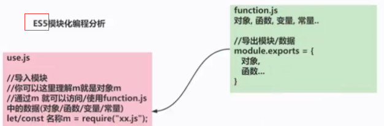
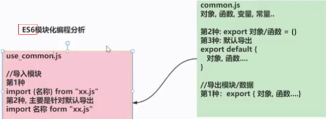
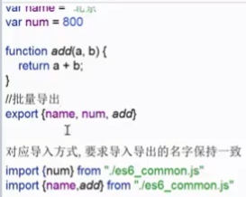
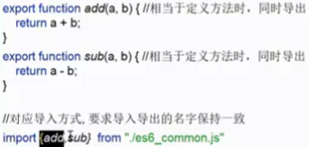
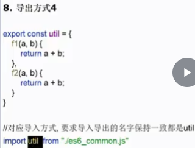
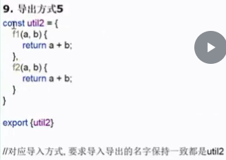

# ES6

## Promise

## 模块化编程

> 每个js文件就是一个模块，有自己的作用域。在文件中定义的变量、函数、类，都是私有的，对其它js文件**不可见**。


### es5

CommonJS使用 `module.exports={}`或`exports={}`导出模块，使用 `let/const 名称=require("xx.js")`导入模块
- 

```javascript
// module/es5/function.js: 定义对象，变量，函数
const sum = function (a, b) {
    return parseInt(a) + parseInt(b);
}

const sub = function (a, b) {
    return parseInt(a) - parseInt(b);
}

let name = "charlie";

const PI = 3.1415;

const monster = {
    name: "牛魔王",
    age: 612,
    hi() {
        console.log("hi, ", this.name);
    }
}

/* 导出
1. module.exports 导出模块
2. 把需要导出的数据，写入到 {} 中即可
3. 可以全部导出，也可以只导出部分
4. 可以理解为以对象的形式导出。导入 const m = require("./require.js");
    通过 m.xxx 使用
5. 如果属性名和函数/变量/对象/常量名...相同，可以简写
6. 有些前端，简写 module.exports = {} 成 exports = {}
 */
module.exports = {
    sum,   // 属性名和对象名相同，则可以简写
    sub,
    myname: name,
    PI
}
// module.exports = {
//     sum: sum,   // 属性名：属性值
//     sub: sub,
//     myname: name,
//     PI: PI
// }
```

```javascript
// module/es5/use.js: 
/* 导入模块
1. 在es5中，通过 require 导入对应的.js模块中的数据/对象
2. 使用的时候，通过 m.属性名 就可以使用
3. 如果导入时，不需要所有的数据/对象，可以导入部分数据
 */
const m = require("./function.js");    // 结尾带不带 .js 后缀都可以

const {sub} = require("./function");    // 只导入 sub

// 使用
console.log(m.sum(1, 9));
console.log(m.sub(1, 9));
console.log(m.myname);
console.log(sub(6, 8));
```

### es6

- 

### 注意事项和细节

1. ES6的模块化无法在Node.js中执行，需要用Babel转码ES5后再执行
2. export不仅可以导出对象，一切JS变量都可以导出。比如：基本数据类型变量、函数、数组、对象
3. 没有导出的不能使用
4. es6导出方式较多，**不同的导出方式对导入方式也有一定影响**
5. 导出方式1：**批量导出**
   - 
6. 导出方式2：**定义时导出**
   - 
7. 导出方式3：**默认导出**，一次导出多个，导入时，导入变量名可以自己指定
   - 
8. 导出方式4：
   - 
9. 导出方式5：
   - 
10. 重点掌握前三种即可