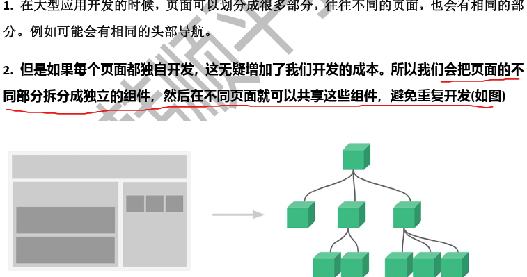
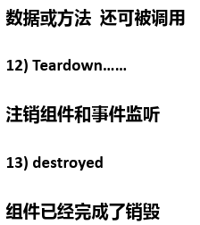

# Vue

## 基本介绍

1. Vue(读音类似于view)是一个前端框架，易于构建用户界面
2. Vue的核心库**只关注视图层**，易于上手，还便于与第三方库或项目整合
3. `Vue`是`Vue.js`的简称

## MVVM

- 
- M(Model)：模型，包括数据和一些基本操作
- V(View视图)：页面渲染结果
- VM(View-Model)，模型与视图间的**双向操作**(无需开发人员干涉)
- 在MVVM之前，开发人员从后端获取需要的数据模型，然后要通过DOM操作Model渲染到View中。而后当用户操作视图时，
  还需要通过DOM获取View中的数据，然后同步到Model中
- 而MVVM中的VM要做的事情就是**把DOM操作完全封装起来**，开发人员不用再关心Model和View之间是如何相互影响的
- 只要Model发生了改变，View上自然就会表现出来，当用户修改View，Model中的数据也会跟着改变

## 快速入门

- 

```html
<!DOCTYPE html>
<html lang="en">
<head>
    <meta charset="UTF-8">
    <title>Vue快速入门</title>
</head>
<body>
    <div id="app">
        <!--
        1. {{message}}：插值表达式
        2. message：就是从model的data数据池中设置
        3. 当代码执行时，会到data{}数据池中去匹配数据，如果匹配上，就进行替换，
            如果没有匹配上，就会输出空
        -->
        <h1>欢迎你{{message}}--{{name}}</h1>
    </div>
<!--引入vue.js-->
<script type="text/javascript" src="vue.js"></script>
<script type="text/javascript">
    // 创建Vue对象
    /**
     * 1. 创建Vue对象实例
     * 2. 在控制台输出vm对象，看看该对象的结构(data/listener)
     */
    let vm = new Vue({
        el: "#app",     // 创建的Vue实例挂到 id="app" 的div
        data: {         // data{} 表示数据池(model有了数据)，有很多数据，以k-v形式设置(根据业务需求来设置)
            message: "Hello Vue!",
            name: "Charlie"
        }
    });
    console.log("vm=>", vm);
    console.log("vm._data=>", vm._data);    // 该对象是对 data{}的封装
    console.log("vm.name=>", vm.name);      // 也可以直接取出 data{} 中的数据
    console.log("vm.message=>", vm.message);
</script>
</body>
</html>
```

### 注意事项和使用细节

1. 注意**代码的顺序，要求div再前，script在后，否则无法绑定数据**。因为代码执行是从上到下的，先有id="app"的div标签，
    然后才可以绑定到它。如果顺序反了，会报错 `[Vue warn]: Cannot find element: #app`
2. 从案例可以体会声明式渲染：Vue.js采用简洁的模板语法来声明式地将数据渲染进DOM的系统，做到**数据和显示分离**
3. Vue没有繁琐的DOM操作，如果使用JQuery，需要先找到div节点，获取到DOM对象，然后进行节点操作。相比之下，显然Vue更加简洁。

## 数据单向渲染

1. `v-bind`指令可以完成基本数据渲染/绑定
2. `v-bind`简写形式就是一个冒号 `:`

```html
<!DOCTYPE html>
<html lang="en" xmlns:v-bind="http://www.w3.org/1999/xhtml">
<head>
    <meta charset="UTF-8">
    <title>单向数据渲染</title>
</head>
<body>
<div id="app">
    <h1>{{message}}</h1>
    <!--
    1. 使用插值表达式{{}}引用data数据池数据是在标签体内的
    2. 如果是在标签/元素的属性上引用data数据池数据时，不能使用插值表达式
    3. 需要使用 v-bind。默认会报红，因为v-bind是Vue来解析的，需要引入命名空间 xmlns:v-bind
    4. v-bind简写形式就是一个冒号 `:`
    -->
    
    
</div>

<script type="text/javascript" src="vue.js"></script>
<script type="text/javascript">
    let vm = new Vue({
        el: "#app",     // 创建的Vue实例挂到 id="app" 的div
        data: {         // data{} 表示数据池(model有了数据)，有很多数据，以k-v形式设置(根据业务需求来设置)
            message: "Hello 黄袍怪!",
            img_src: "ikun.png",
            img_width: "200px"
        }
    });
    console.log("vm=>", vm);
</script>
</body>
</html>
```

### 注意事项和使用细节

1. **插值表达式**是用在**标签体**的，如 `<h1>{{message}}</h1>`
2. 如果给**标签属性**绑定值，则使用 `v-bind` 指令

## 数据双向绑定

- `v-model`可以完成**双向数据绑定**
- 
- [练习题](04_homework.html)

```html
<!DOCTYPE html>
<html lang="en">
<head>
    <meta charset="UTF-8">
    <title>双向数据渲染</title>
</head>
<body>
<div id="app">
    <h1>{{message}}</h1>
    <!--
    1. v-bind是数据单向绑定：data数据池绑定的数据变化，会影响到view
    2.v-model="hobby.val" 是数据的双向渲染
        1) data数据池绑定的数据变化，会影响到view  【底层机制：Data Bindings】
        2) view关联的元素值变化，会影响到data数据池的数据  【底层机制：Dom Listeners】
    -->
    <input type="text" v-model="hobby.val"><br/>
    <input type="text" :value="hobby.val"><br/>
    <p>你输入的爱好是：{{hobby.val}}</p>
</div>

<script type="text/javascript" src="vue.js"></script>
<script type="text/javascript">
    let vm = new Vue({
        el: "#app",
        data: {
            message: "武林至尊 宝刀屠龙 号令天下 莫敢不从 倚天不出 谁与争锋",
            hobby: {
                val: "购物",
            }
        }
    })
</script>
</body>
</html>
```

## 事件绑定

1. 使用 `v-on` 进行事件处理，比如：`v-on:click`表示处理鼠标点击事件
2. 事件调用的方法定义在vue对象声明的 `methods` 节点中
3. `v-on`：事件名，可以绑定指定事件
   - 

```html
<!DOCTYPE html>
<html lang="en" xmlns:v-on="http://www.w3.org/1999/xhtml">
<head>
    <meta charset="UTF-8">
    <title>事件绑定</title>
</head>
<body>
<!--视图-->
<div id="app">
    <h1>{{message}}</h1>
    <!--
    1. v-on:click 表示给button元素绑定一个click事件
    2. sayHi() 绑定的方法，在方法池 methods 中定义
    3. 底层仍然是DOM编程
    -->
    <button v-on:click="sayHi()">点击输出1</button>
    <button v-on:click="sayOK()">点击输出2</button>
    <button>点击输出3</button>
    <button>点击输出4</button>
</div>

<!--引入vue.js-->
<script src="vue.js"></script>
<script>
    // 这里创建的vue实例，可以不去接收，也可以接收方便调试
    let vm = new Vue({
        el: "#app",     // el就是element的简写
        data: {
            message: "Hello, Vue!",
            name: "charlie"
        },
        // 1. 是一个methods属性，对应的值是对象 {}
        // 2. 在 {} 中，可以写很多的方法，可以简单地理解为是一个方法池
        methods: {
            sayHi() {
                console.log("hi, 银角大王");
            },
            sayOK() {
                console.log("Hi, 金角大王");
            }
        }
    })
</script>
</body>
</html>
```

### 注意事项和使用细节

1. 如果方法没有参数，可以省略 `()` ，需要浏览器支持
2. `v-on`指令的简写形式 `@`，需要浏览器支持
3. 可以通过元素查看可以绑定的事件
   - 
4. [课后作业：点击增加cnt值](06_homework.html)
5. [课后作业：提示输入框内容](07_homework.html)

## 修饰符

> 在JavaScript中，所有变量都可以作为一个boolean类型进行条件判断
> - 0, null, undefined, ""(空串)都认为是 `false`

1. **修饰符(Modifiers)是以 `.` 指明的后缀，指出某个指令以特殊方式绑定**
2. 例如，`.prevent`修饰符告诉 `v-on` 指令对于触发的事件调用 `event.preventDefault()`， 即**阻断事件原本的默认行为**

| **事件修饰符**                         | 功能                                      |
|-----------------------------------|-----------------------------------------|
| `.stop`                           | 阻止事件继续传播                                |
| `.prevent`                        | 阻止标签默认行为                                |
| `.capture`                        | 使用事件捕获模式，即元素自身触发的事件先在此处处理，然后才交由内部元素进行处理 |
| `.self`                           | 只当在 `event.target` 是当前元素自身时触发处理函数       |
| `.once`                           | **事件将只会触发一次**                           |
| `.passive`                        | 告诉浏览器你不想阻止事件的默认行为                       |
| **键盘事件的修饰符**                      |                                         |
| `<input v-on:keyup.13="submit">`  | 当按键为回车键(keyCode=13)时，执行submit方法         |
| **v-model的修饰符**                   |                                         |
| `<input v-model.trim="msg">`      | 自动过滤用户输入的首尾空格                           |

- 

```html
<!DOCTYPE html>
<html lang="en" xmlns:v-on="http://www.w3.org/1999/xhtml">
<head>
    <meta charset="UTF-8">
    <title>Vue修饰符说明</title>
</head>
<body>
<div id="app">
    <h1>Vue修饰符</h1>
    <!--
    1. 修饰符用于指出一个指令应该以特殊的方式绑定
    2. v-on:submit.prevent 的 .prevent 修饰符表示组织表单提交的默认行为
    3. 执行程序员指定的方法
    4. v-model="monster.name" 在数据池中monster对象没有定义name属性，而是在这里进行了动态绑定
    -->
    <form action="http://www.baidu.com" v-on:submit.prevent="onMySubmit">
        妖怪名：<input type="text" v-model="monster.name"><br/><br/>
        <button type="submit">注册</button>
    </form>
    <p>服务器返回的数据：{{count}}</p>
    <h1>修饰符扩展案例</h1>
    <!--设置点击事件只生效一次-->
    <button v-on:click.once="onMySubmit">点击一次</button><br/>
    <!--指定为enter键的keyup-->
    <input type="text" v-on:keyup.enter="onMySubmit"><br/>
    <!--去除输入内容左右两侧的空格-->
    <input type="text" v-model.trim="count"><br/>
</div>

<script type="text/javascript" src="vue.js"></script>
<script>
    let vm = new Vue({
        el: "#app",
        data: {     // 数据池
            monster: {  // monster数据(对象)的属性，可以动态生成
            },
            count: 0
        },
        methods: {  // 方法池
            onMySubmit() {
                // null, "", undefined 都是 false
                if (this.monster.name) {
                    console.log("提交表单，name：", this.monster.name);
                    // 这里就可以根据自己的业务发出ajax请求到服务器，得到数据后，再进行数据更新
                    this.count = 666;
                } else {
                    console.log("请输入名字！");
                }
            }
        }
    })
</script>
</body>
</html>
```

## 条件渲染/控制：v-if/v-show

1. `v-if`指令用于条件性地渲染一块内容。这块内容只会在指令地表达式返回truthy值地时候被渲染。
   - 
2. `v-show`用法大致一样，不同的是带有 `v-show` 的元素始终会被渲染并保留在DOM中。`v-show`只是简单的切换元素的CSS property(`display`)

|  |  |
|-------------------------|-------------------------|

> 在Vue.js中，`v-model`指令用于在表单输入元素上创建双向数据绑定。对于不同类型的表单输入数据，绑定的是不同的属性

```html
<!DOCTYPE html>
<html lang="en">
<head>
    <meta charset="UTF-8">
    <title>v-if的应用实例</title>
</head>
<body>
<div id="app">
    <!--这里可以看到checkbox的属性checked-->
    <input type="checkbox" v-model="sel">是否同意条款【v-if实现】
    <!--v-if/v-else 会根据返回的值，来决定是否动态地创建对应的组件，真正地创建和销毁子组件-->
    <h1 v-if="sel">你同意条款</h1>
    <h1 v-else>你不同意条款</h1>
</div>

<script type="text/javascript" src="vue.js"></script>
<script>
    let vm = new Vue({
        el: "#app",
        data: {
            sel: false
        }
    })
</script>
</body>
</html>
```

```html
<!DOCTYPE html>
<html lang="en">
<head>
    <meta charset="UTF-8">
    <title>v-show的应用实例</title>
</head>
<body>
<div id="app">
    <!--这里可以看到checkbox的属性checked-->
    <input type="checkbox" v-model="sel">是否同意条款【v-show实现】
    <!--v-show：不管初始条件是什么，元素总是会被渲染，并且知识对css进行切换-->
    <h1 v-show="sel">你同意条款</h1>
    <h1 v-show="!sel">你不同意条款</h1>
</div>

<script type="text/javascript" src="vue.js"></script>
<script>
    let vm = new Vue({
        el: "#app",
        data: {
            sel: false
        }
    })
</script>
</body>
</html>
```

### v-if VS v-show

1. `v-if`会确保在切换状态过程中，条件块内的事件监听器和子组件的销毁和重建，即**v-if值为false的元素不会被渲染**
2. `v-show`机制相对简单，不管初始条件是什么，元素总是会被渲染，并且**只是对CSS的属性进行切换**
3. [课后作业：根据输入的分数输出对应的级别](11_homework.html)
   - 

## 列表渲染：v-for

1. 对数组进行遍历
   - 
2. 用`v-for`来遍历一个对象的property
   - 

```html
<!DOCTYPE html>
<html lang="en">
<head>
    <meta charset="UTF-8">
    <title>列表渲染</title>
</head>
<body>
<div id="app">
    <h1>简单的列表渲染</h1>
    <ul>
        <!--1 2 3-->
        <li v-for="i in 3">{{i}}</li>
    </ul>
    <h1>简单的列表渲染-带索引</h1>
    <ul>
        <!--0-1 1-2 2-3-->
        <li v-for="(value, index) in 3">{{index}}-{{value}}</li>
    </ul>
    <h1>遍历数据列表</h1>
    <table width="300px" border="2px">
        <tr v-for="monster in monsters">
            <td>{{monster.id}}</td>
            <td>{{monster.name}}</td>
            <td>{{monster.age}}</td>
        </tr>
    </table>
</div>

<script type="text/javascript" src="vue.js"></script>
<script>
    new Vue({
        el: "#app",
        data: {
            items: [1, 8, 9, 5],
            monsters: [
                {id: 1, name: "牛魔王", age: 856},
                {id: 2, name: "黄风怪", age: 766},
                {id: 3, name: "青牛怪", age: 997}
            ]
        }
    })
</script>
</body>
</html>
```

- 

```html
<!DOCTYPE html>
<html lang="en">
<head>
    <meta charset="UTF-8">
    <title>v-for课后作业</title>
</head>
<body>
<div id="app">
    <h1>学生成绩列表-及格学生</h1>
    <table width="360px" border="2px">
        <tr>
            <th>id</th>
            <th>name</th>
            <th>age</th>
            <th>score</th>
        </tr>
        <!--只显示及格(score>=60)的学生-->
        <tr v-for="student in students" v-if="student.score >= 60">
            <td>{{student.id}}</td>
            <td>{{student.name}}</td>
            <td>{{student.age}}</td>
            <td>{{student.score}}</td>
        </tr>
    </table>
</div>

<script type="text/javascript" src="vue.js"></script>
<script>
    new Vue({
        el: "#app",
        data: {
            students: [
                {id: 1, name: "charlie", age: 22, score: 96},
                {id: 2, name: "jack", age: 26, score: 70},
                {id: 3, name: "tom", age: 17, score: 36},
                {id: 3, name: "jerry", age: 25, score: 56},
                {id: 3, name: "leon", age: 20, score: 92}
            ]
        }
    })
</script>
</body>
</html>
```

## 组件化编程

1. 
2. 组件(Component)是Vue.js最强大的功能之一，可以提高复用性
3. 组件也是一个Vue实例，也包括：data, methods, 生命周期函数等
4. **组件渲染需要html模板**，所以增加了 `template` 属性，值就是HTML模板
5. 对于全局组件，任何Vue实例都可以直接在HTML中通过组件名称来使用组件
6. **`data`是一个函数，不再是一个对象，这样每次引用组件都是独立的对象/数据**

- 

```html
<!DOCTYPE html>
<html lang="en">
<head>
    <meta charset="UTF-8">
    <title>组件化编程</title>
</head>
<body>
<div id="app">
    <!--非组件化方式-普通方式-->
    <button @click="click">点击按钮{{i}}次【非组件化方式】</button><br/><br/>
    <!--需求是，有多个按钮，都需要进行点击统计-->
    <button @click="click2">点击按钮{{j}}次【非组件化方式】</button><br/>
    <!--1. 这俩按钮完成的功能其实是一样的，但是目前都重写了一次，复用性差
    2. 点击各个按钮的业务都是对次数+1，业务处理类似，但是也都重写了方法，复用性差
    3. 问题是在于直接复制会共享数据和方法，并非所需-->
</div>

<script type="text/javascript" src="vue.js"></script>
<script>
    new Vue({
        el: "#app",
        data: {
            i: 0,
            j: 0
        },
        methods: {
            click() {
                this.i++;
            },
            click2() {
                this.j++;
            }
        }
    })
</script>
</body>
</html>
```

- 

```html
<!DOCTYPE html>
<html lang="en">
<head>
    <meta charset="UTF-8">
    <title>组件化编程-全局组件</title>
</head>
<body>
<div id="app">
    <h1>组件化编程-全局组件</h1>
    <!--使用全局组件-->
    <counter></counter><br/><br/>
    <counter></counter><br/><br/>
</div>

<div id="app2">
    <h1>组件化编程-全局组件2</h1>
    <!--使用全局组件-->
    <counter></counter><br/><br/>
</div>

<script type="text/javascript" src="vue.js"></script>
<script>
    // 1. 定义一个全局组件，名称为counter
    // 2. {} 表示组件相关内容
    // 3. template指定该组件的界面，因为会引用到数据池的数据，所以需要是模板字符串
    // 4. 说明：要把组件视为一个Vue实例，也有自己的数据池和methods
    // 5. 对于组件，数据池的数据是使用方法/函数返回【为了保证每个组件的数据是独立的】！因为原来的方式数据是共享的
    // 6. 这时就达到了界面通过template实现共享，业务处理也复用
    // 7. 全局组件是属于所有的Vue实例，因此可以在所有的vue实例中使用，有点类似于Vue类的静态成员
    Vue.component("counter", {
        template: `<button v-on:click="click">点击次数={{count}}次【全局组件化】</button>`,
        data() {    // 这里需要注意，和原来的方式不一样！！！
            return {
                count: 10
            }
        },
        // [Vue warn]: The "data" option should be a function that returns a pre-instance value in component definitions.
        // data: {
        //     count: 10
        // },
        methods: {
            click() {
                this.count++;
            }
        }
    });

    // 创建Vue实例，必须有
    let vm = new Vue({
        el: "#app",
    })

    // 所有的Vue实例都可以使用到全局组件
    let vm2 = new Vue({
        el: "#app2"
    })
</script>
</body>
</html>
```

- 

```html
<!DOCTYPE html>
<html lang="en">
<head>
    <meta charset="UTF-8">
    <title>组件化编程-局部组件</title>
</head>
<body>
<div id="app">
    <h1>组件化编程-局部组件</h1>
    <!--使用局部组件，该组件是从挂载到app的vue中获取的-->
    <my_counter></my_counter><br/><br/>
    <my_counter></my_counter><br/><br/>
    <my_counter></my_counter><br/><br/>
</div>

<div id="app2">
    <h1>组件化编程-局部组件2</h1>
    <!--不引入局部组件的无法使用，[Vue warn]: Unknown custom element: <my_counter>-->
    <my_counter></my_counter><br/><br/>
</div>

<script type="text/javascript" src="vue.js"></script>
<script>
    // 定义一个组件，组件的名称为 buttonCounter
    // 1. 可以把常用的组件，定义在 common.js 文件中
    // 2. 某个页面需要使用，直接 import
    const buttonCounter = {
        template: `<button v-on:click="click">点击次数={{count}}次【局部组件化】</button>`,
        data() {    // 这里需要注意，和原来的方式不一样！！！
            return {
                count: 10
            }
        },
        methods: {
            click() {
                this.count++;
            }
        }
    }

    // 创建Vue实例，必须有
    let vm = new Vue({
        el: "#app",
        components: {    // 引入某个组件，此时 my_counter 就是一个组件，是一个局部组件，使用范围就在当前Vue
            "my_counter": buttonCounter
        }
    })

    let vm2 = new Vue({
        el: "#app2",
        // 在该vue实例中，必须引入局部组件才能使用
        // components: {
        //     "my_counter": buttonCounter
        // }
    })
</script>
</body>
</html>
```

## 生命周期和监听函数(钩子(hook)函数)

1. Vue实例有一个完整的生命周期，即从**开始创建、初始化数据、编译模板、挂载DOM、渲染-更新-渲染，卸载等一系列过程**，称之为Vue实例的生命周期。
2. 钩子函数(监听函数)：Vue实例在完整的生命周期过程中(比如设置数据监听、编译模板、将实例挂载到DOM、数据变化时更新DOM等)会运行的函数，叫作生命周期钩子的函数
3. **钩子函数的作用就是在某个阶段，给程序员一个做某些处理的机会**

|  |
|--------------------------|

### 生命周期解读

| 生命周期                                             | 含义                                                                              |
|--------------------------------------------------|----------------------------------------------------------------------|
| `new Vue()`                                      | new了一个Vue实例对象，此时就会进入组件的创建过程                                                     |
| `init Events & Lifecycle`                        | 初始化组件的事件和生命周期函数                                                                 |
| **`beforeCreate`**                               | 组件创建止遇到的第一个生命周期函数，这个阶段data和methods以及dom结果都未被初始化，<br/>即获取不到data值，不能调用methods中的函数 |
| `init injections & reactivity`                   | 正在初始化data和methods中的方法                                                           |
| **`created`**                                    | data和methods中的方法已初始化结束，可以访问，但是dom结构未初始化，页面未渲染                                   |
| 编译模板结构(在内存)                                      |                                                                                 |
| **`beforeMount`**                                | 模板在内存中编译完成，此时内存中的模板结构还未渲染至页面上，看不到真实的数据                                          |
| `create vm.$el and replace 'el' with it`         | 这一步把内存中渲染号的模板结构替换至真是的dom结构也就是页面上                                                |
| **`mounted`**                                    | 此时页面渲染好，用户看到的是真实的页面数据，生命周期创建完毕，进入到了运行中的阶段                                       |
| `生命周期运行中`                                        |                                                                                 |
| **`beforeUpdate`**                                   | 当执行此函数时，数据池中的数据是新的，但是页面还是旧的                                                     |
| `Virtual DOM re-render and patch`                | 根据最新的data数据，重新渲染内存中的模板结构，并把渲染好的模板结果，替换至页面上                                      |
| **`updated`**                                        | 页面已经完成了更新，此时data数据和页面的数据都是新的                                                    |
|                         |                                                                                 |

```html
<!DOCTYPE html>
<html lang="en">
<head>
    <meta charset="UTF-8">
    <title>Vue声明周期函数和钩子函数</title>
</head>
<body>
<!--这里可以视为用户看到的页面，对应页面讲解的页面DOM-->
<div id="app">
    <span id="num">{{num}}</span>
    <button @click="num++">点赞！</button>
    <h2>{{name}}，有{{num}}次点赞</h2>
</div>

<script type="text/javascript" src="vue.js"></script>
<script>
    new Vue({
        el: "#app",
        data: { // 数据池
            name: "charlie",
            num: 0
        },
        methods: {  // 方法池
            show() {
                return this.name;
            },
            add() {
                this.num++;
            }
        },
        beforeCreate() {    // 生命周期函数-创建Vue实例前
            console.log("========beforeCreate========");
            // undefined   undefined
            console.log("数据模型/数据池的数据是否加载/使用？[no]", this.name, " ", this.num);
            // [Vue warn]: Error in beforeCreate hook: "TypeError: this.show is not a function"
            // console.log("自定义方法是否加载/使用？[no]", this.show());
            // <span id="num">{{num}}</span>
            console.log("用户页面DOM是否加载/使用？[yes]", document.getElementById("num"));
            // {{num}}
            console.log("用户页面DOM是否被渲染？[no]", document.getElementById("num").innerText);
        },
        created() {  // 生命周期函数-创建Vue实例
            console.log("========created========");
            // charlie   0
            console.log("数据模型/数据池的数据是否加载/使用？[yes]", this.name, " ", this.num);
            // charlie
            console.log("自定义方法是否加载/使用？[yes]", this.show());
            // <span id="num">{{num}}</span>
            console.log("用户页面DOM是否加载/使用？[yes]", document.getElementById("num"));
            // {{num}}
            console.log("用户页面DOM是否被渲染？[no]", document.getElementById("num").innerText);
            // 可以发出Ajax请求
            // 接收返回的数据
            // 再次去更新data数据池的数据
            // 编译内存模板结构
            // ...
        },
        beforeMount() { // 生命周期函数-挂载前
            console.log("========beforeMount========");
            // charlie   0
            console.log("数据模型/数据池的数据是否加载/使用？[yes]", this.name, " ", this.num);
            // charlie
            console.log("自定义方法是否加载/使用？[yes]", this.show());
            // <span id="num">{{num}}</span>
            console.log("用户页面DOM是否加载/使用？[yes]", document.getElementById("num"));
            // {{num}}
            console.log("用户页面DOM是否被渲染？[no]", document.getElementById("num").innerText);
        },
        mounted() { // 生命周期函数-挂载后
            console.log("========mounted========");
            // charlie   0
            console.log("数据模型/数据池的数据是否加载/使用？[yes]", this.name, " ", this.num);
            // charlie
            console.log("自定义方法是否加载/使用？[yes]", this.show());
            // <span id="num">{{num}}</span>
            console.log("用户页面DOM是否加载/使用？[yes]", document.getElementById("num"));
            // 0
            console.log("用户页面DOM是否被渲染？[yes]", document.getElementById("num").innerText);
        },
        beforeUpdate() {    // 生命周期函数-数据池数据更新前
            console.log("========beforeUpdate========");
            // charlie   1  数据池中的数据已经发生改变！
            console.log("数据模型/数据池的数据是否加载/使用？[yes]", this.name, " ", this.num);
            // charlie
            console.log("自定义方法是否加载/使用？[yes]", this.show());
            // <span id="num">{{num}}</span>
            console.log("用户页面DOM是否加载/使用？[yes]", document.getElementById("num"));
            // 0    但是用户页面DOM中的数据还没有更新！
            console.log("用户页面DOM是否被更新？[no]", document.getElementById("num").innerText);
            // 验证数据===>修正
            if (this.num < 10) {    // 示意
                this.num = 6;
            }
        },
        updated() { // 生命周期函数-数据池数据更新后
            console.log("========updated========");
            // charlie   1  数据池中的数据已经发生改变！
            console.log("数据模型/数据池的数据是否加载/使用？[yes]", this.name, " ", this.num);
            // charlie
            console.log("自定义方法是否加载/使用？[yes]", this.show());
            // <span id="num">{{num}}</span>
            console.log("用户页面DOM是否加载/使用？[yes]", document.getElementById("num"));
            // 1    内存中的数据更新到用户页面DOM
            console.log("用户页面DOM是否被更新？[yes]", document.getElementById("num").innerText);
        }
    })
</script>
</body>
</html>
```
