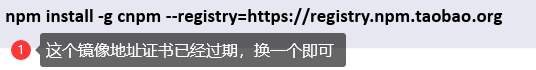
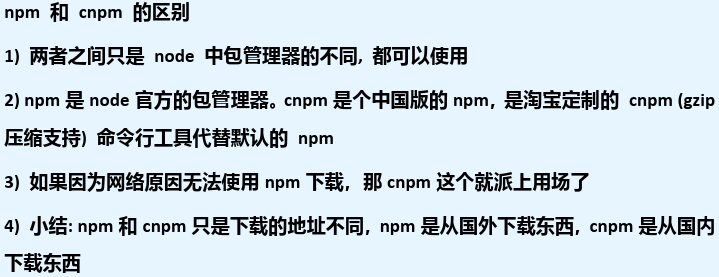
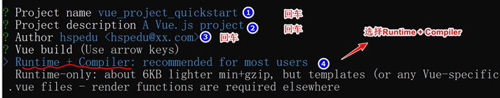
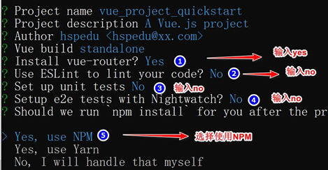
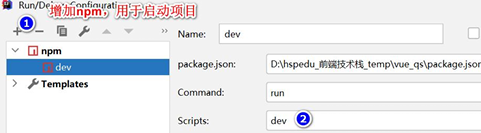
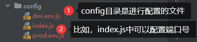

# Vue2脚手架模块开发

## 环境配置，搭建项目

1. 搭建Vue脚手架工程，需要使用到NPM(node package manager)，npm是随`nodejs`安装的一款
   包管理工具，类似Maven
2. 环境配置
   1) 安装Nodejs(v10.16.3)
      - 
   2) 删除以前的cli版本，不论之前是否下载过
      - 
   3) 安装淘宝镜像 `cnpm`
      - 
      - 
   4) 安装webpack和webpack-cli，指令 `npm install webpack@4.41.2 webpack-cli -D`
   5) 安装 `cnpm install -g @vue/cli@4.0.3`
      - 
3. 搭建项目
   1) 创建目录，并cmd到该目录。如在 `front_web`目录下创建`vue_project`项目
      - 
   2) 配置项目
      - 
      - 
   3) 进入到项目目录，运行项目 `npm run dev`
4. IDEA运行项目
   1) 直接open或将项目目录拖拽到IDEA
   2) Edit Configurations->增加npm，用于启动项目->设置`Script:dev`
      - 

## Vue项目结构分析

- 
- 
- 

## Vue请求页面执行流程

> ① `src/main.js`
> 1. 入口js
> 2. 创建了Vue实例
> 3. 指定了el挂载到`id=app`的div
> 4. 指定router从router目录导入
> 5. 指定component引入组件，该组件是 `import App from './App'`
> 6. 指定了`template: '<App/>'`，这里的App就是从components{App}
> 7. 进行录入，找到路由文件 `router/index.js`，同时得到url `http://localhost:8080/#/` 得到path(`/`)

```javascript
// The Vue build version to load with the `import` command
// (runtime-only or standalone) has been set in webpack.base.conf with an alias.
import Vue from 'vue'
import App from './App'       // './App.vue' 的简写
import router from './router' // './router/index.js' 的简写

Vue.config.productionTip = false

/* eslint-disable no-new */
new Vue({
  el: '#app',
  router,               // router: router
  components: { App },  // {'App': App} 的简写，因为属性和值名称相同，根据es6标准，可以这么简写
  template: '<App/>'    // 对应于字符串 'App'
})
```

> ② `router/index.js`
> 1. 创建Router对象，当作组件
> 2. `routes:[]` 路由表，可以指定多个路由(就是一个访问路径)
> 3. 请求url `http://localhost:8080/#/` 得到path(`/`)
> 4. 对应找到`component: HelloWorld`

```javascript
import Vue from 'vue'
import Router from 'vue-router'
import HelloWorld from '@/components/HelloWorld'

Vue.use(Router)

export default new Router({
  routes: [
    {
      path: '/',
      name: 'HelloWorld',
      component: HelloWorld
    }
  ]
})
```

> ③ `src/components/HelloWorld.vue`
> 1. 自定义组件
> 2. 可以显示页面
> 3. 进行编译，得到视图
> 4. 将编译后的视图/页面返回

```vue
<template>
  // ...
</template>

<script>
export default {
  name: 'HelloWorld',
  data () {
    return {
      msg: 'Welcome to Your Vue.js App'
    }
  }
}
</script>
```

- ④ 返回到 `src/main.hs` 的 `components: {App}`
- ⑤ `template: '<App/>'`

> ⑥ `src/App.vue`
> 1. 是我们项目的主体单页
> 2. 这里引入了 `<router-view/>`
> 3. 就可以显示路由后的视图/页面

```vue
<template>
  <div id="app">
    
    <!--将路由后的页面/视图，引入导这里-->
    <router-view/>
  </div>
</template>

<script>
export default {
  name: 'App'
}
</script>
```

> ⑦ `vue_project/index.html`
> 1. 是项目首页
> 2. 定义了 `div id=app`
> 3. 当Vue实例创建好，并渲染好后，就会挂载到div
> 4. 用户就看到了最后的效果

```html
<!DOCTYPE html>
<html>
<head>
  <meta charset="utf-8">
  <meta name="viewport" content="width=device-width,initial-scale=1.0">
  <title>vue_project</title>
</head>
<body>
<div id="app"></div>
<!-- built files will be auto injected -->
</body>
</html>
```

## Vue项目中简写状态

- 因为Vue默认生成的项目代码使用了很多简写，造成理解困难，以下进行梳理
- 整个页面渲染过程中，`main.js`是中心，也是连接各个组件、路由器的关键，以`main.js`为例分析

```javascript
import Vue from 'vue'
import App from './App'       // './App.vue' 的简写，省略了文件后缀名
import router from './router' // './router/index.js' 的简写，省略了目录下的index.js文件名

Vue.config.productionTip = false

new Vue({
  el: '#app',           // 这里 #app 是指挂载到 index.html 的 <div id="app"></div> 上
  router,               // 完整写法是 router: router，第二个router是 import router(这个) from './router'
  components: { App },  // {'App': App} 的简写，因为属性和值名称相同，根据es6标准，可以省略 'App'
  template: '<App/>'    // 这里的 '<App/>' 的 App 就是上面 components 引入的组件名字，即 'App'
  // components: { 'MyApp': App },
  // template: '<MyApp/>'
})
```

## 路由切换-课后作业

- `src/components/Hello.vue`创建组件
- **组件的三个部分** `template`, `script`, `stylt`

```vue
<template>
  <div class="hello">
    
    <h1>{{msg}}</h1>
  </div>
</template>

<script>
export default {
  name: 'Hello',
  data () {
    return {
      msg: 'Hello, mary'
    }
  }
}
</script>

<style scoped>

</style>
```

- `src/router/index.js`增加路由

```javascript
import Vue from 'vue'
import Router from 'vue-router'
// 一定要引入 Hello.vue 组件 @表示src目录
import Hello from '@/components/Hello'

Vue.use(Router)

export default new Router({
  routes: [
    {   // 配置路由
      path: '/hello',
      name: 'Hello',
      component: Hello
    }
  ]
})
```

## ElementUI使用

- [ElementUI官网](https://element.eleme.cn/#/zh-CN)
- ElementUI是组件库，网站快速成型工具
- 安装element-ui组件库 `> npm i element-ui@2.12.0`
- 在 `src/main.js` 中引入，并使用
- [ElementUI课后练习](src/components/Homework.vue)

```javascript
import Vue from 'vue'
import App from './App'
import router from './router'
// 引入elementUI组件库
import ElementUI from 'element-ui'
import 'element-ui/lib/theme-chalk/index.css'

// 使用ElementUI插件
Vue.use(ElementUI)
Vue.config.productionTip = false

/* eslint-disable no-new */
new Vue({
  el: '#app',
  router,
  components: { App },
  template: '<App/>'
})
```

```vue
<template>
  <div>
    <h1>{{ msg }}</h1>
    <!--引入/使用ElementUI组件-->
    <el-row>
      <el-button>默认按钮</el-button>
      <el-button type="primary">主要按钮</el-button>
      <el-button type="success">成功按钮</el-button>
      <el-button type="info">信息按钮</el-button>
      <el-button type="warning">警告按钮</el-button>
      <el-button type="danger">危险按钮</el-button>
    </el-row>
    <!--InputNumber计数器-->
    <el-input-number v-model="num" style="width: 200px" @change="handleChange" :min="1" :max="10" label="描述文字"></el-input-number>
    <table>
      <tr>
        <th colspan="3">第1行第1列</th>
      </tr>
      <tr>
        <td rowspan="2">第2行第1列</td>
        <td>第2行第2列</td>
        <td>第2行第3列</td>
      </tr>
      <tr>
        <td>第3行第2列</td>
        <td>第3行第3列</td>
      </tr>
      <tr>
        <td rowspan="2">第4行第1列</td>
        <td>第4行第2列</td>
        <td>第4行第3列</td>
      </tr>
      <tr>
        <td>红烧肉</td>
        <td>第5行第3列</td>
      </tr>
    </table>
  </div>
</template>

<script>
export default {
  name: 'Hsp',
  data() {
    return {
      msg: 'Welcome to Hsp!',
      num: 1
    }
  },
  methods: {
    handleChange(value) {
      // 这里可以获取到用户增加/减少的只
      console.log(value);
    }
  }
}
</script>

<style scoped>

</style>
```
