# Vue2脚手架模块开发

## 环境配置，搭建项目

1. 搭建Vue脚手架工程，需要使用到NPM(node package manager)，npm是随`nodejs`安装的一款
   包管理工具，类似Maven
2. 环境配置
   1) 安装Nodejs(v10.16.3)
      - 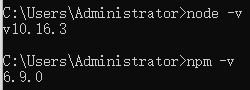
   2) 删除以前的cli版本，不论之前是否下载过
      - 
   3) 安装淘宝镜像 `cnpm`
      - 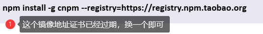
      - 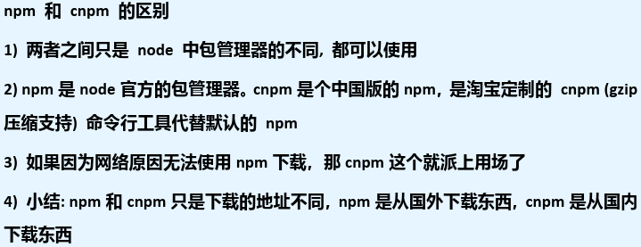
   4) 安装webpack和webpack-cli，指令 `npm install webpack@4.41.2 webpack-cli -D`
   5) 安装 `cnpm install -g @vue/cli@4.0.3`
      - 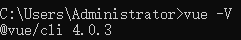
3. 搭建项目
   1) 创建目录，并cmd到该目录。如在 `front_web`目录下创建`vue_project`项目
      - 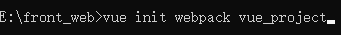
   2) 配置项目
      - 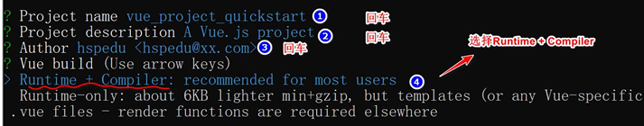
      - 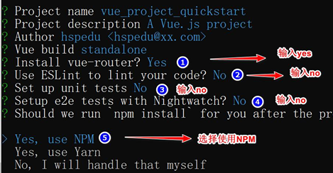
   3) 进入到项目目录，运行项目 `npm run dev`
4. IDEA运行项目
   1) 直接open或将项目目录拖拽到IDEA
   2) Edit Configurations->增加npm，用于启动项目->设置`Script:dev`
      - 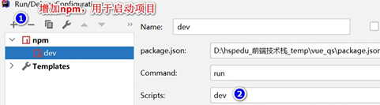

## Vue项目结构分析

- 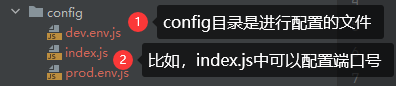
- 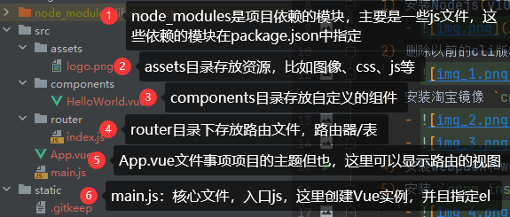
- 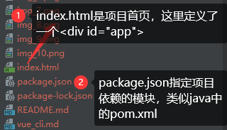

## Vue请求页面执行流程

> ① `src/main.js`
> 1. 入口js
> 2. 创建了Vue实例
> 3. 指定了el挂载到`id=app`的div
> 4. 指定router从router目录导入
> 5. 指定component引入组件，该组件是 `import App from './App'`
> 6. 指定了`template: '<App/>'`，这里的App就是从components{App}
> 7. 进行录入，找到路由文件 `router/index.js`，同时得到url `http://localhost:8080/#/` 得到path(`/`)

```javascript
// The Vue build version to load with the `import` command
// (runtime-only or standalone) has been set in webpack.base.conf with an alias.
import Vue from 'vue'
import App from './App'       // './App.vue' 的简写
import router from './router' // './router/index.js' 的简写

Vue.config.productionTip = false

/* eslint-disable no-new */
new Vue({
  el: '#app',
  router,               // router: router
  components: { App },  // {'App': App} 的简写，因为属性和值名称相同，根据es6标准，可以这么简写
  template: '<App/>'    // 对应于字符串 'App'
})
```

> ② `router/index.js`
> 1. 创建Router对象，当作组件
> 2. `routes:[]` 路由表，可以指定多个路由(就是一个访问路径)
> 3. 请求url `http://localhost:8080/#/` 得到path(`/`)
> 4. 对应找到`component: HelloWorld`

```javascript
import Vue from 'vue'
import Router from 'vue-router'
import HelloWorld from '@/components/HelloWorld'

Vue.use(Router)

export default new Router({
  routes: [
    {
      path: '/',
      name: 'HelloWorld',
      component: HelloWorld
    }
  ]
})
```

> ③ `src/components/HelloWorld.vue`
> 1. 自定义组件
> 2. 可以显示页面
> 3. 进行编译，得到视图
> 4. 将编译后的视图/页面返回

```vue
<template>
  // ...
</template>

<script>
export default {
  name: 'HelloWorld',
  data () {
    return {
      msg: 'Welcome to Your Vue.js App'
    }
  }
}
</script>
```

- ④ 返回到 `src/main.hs` 的 `components: {App}`
- ⑤ `template: '<App/>'`

> ⑥ `src/App.vue`
> 1. 是我们项目的主体单页
> 2. 这里引入了 `<router-view/>`
> 3. 就可以显示路由后的视图/页面

```vue
<template>
  <div id="app">
    
    <!--将路由后的页面/视图，引入导这里-->
    <router-view/>
  </div>
</template>

<script>
export default {
  name: 'App'
}
</script>
```

> ⑦ `vue_project/index.html`
> 1. 是项目首页
> 2. 定义了 `div id=app`
> 3. 当Vue实例创建好，并渲染好后，就会挂载到div
> 4. 用户就看到了最后的效果

```html
<!DOCTYPE html>
<html>
<head>
  <meta charset="utf-8">
  <meta name="viewport" content="width=device-width,initial-scale=1.0">
  <title>vue_project</title>
</head>
<body>
<div id="app"></div>
<!-- built files will be auto injected -->
</body>
</html>
```
